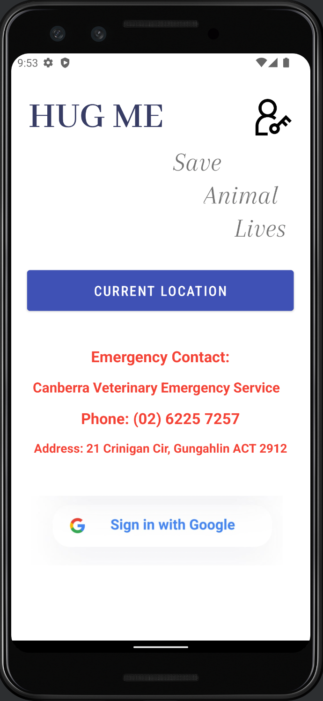

# LLTX Report

## Table of Contents
1. [Team Members and Roles](#team-members-and-roles)
2. [Summary of Individual Contributions](#summary-of-individual-contributions)
3. [Application Description](#application-description)
4. [Application Summary with Screenshots](#application-summary-with-screenshots)
5. [Application UML](#application-uml)
6. [Application Design and Decisions](#application-design-and-decisions)
7. [Implemented Features](#implemented-features)
8. [Team Meetings](#team-meetings)

## Team Members and Roles

| UID | Name | Role |
| :--- | :----: | ---: |
| u7079635 | Qianxuan Lin | Tokenizer and Parser, Simple GPS |
| u7272317 | Xie Hu | Firebase, Google Login, post insert and delete, like function |
| u7228238 | Ting Tang | UI design, APP features: add new posts and comment, Create Data Instance |
| u7305966 | Xitong Liu | UI, APP featrues: Admin login, posts display, search posts and display |

## Summary of Individual Contributions

**U7079635, Qianxuan Lin, I contribute 25% of the project.**
Here are my contributions:
* LocationActivity.class
* Tokenizer.class
* Parser.class
* Token.class
* BreedExp.class
* ConcateExp.class
* SpeciesExp.class
* Exp.class
* PostActivity.class: search part, collaborate with Xitong Liu

**U7272371, Name: Xie Hu, I contribute 25% of the project.**
Here are my contributions:
* (Code implementation) Firebase setup
* (Code implementation) google login and logout
* (Code implementation) UriTool.class (all)
* (Code implementation) MainActivity.class:  sigIn(), onActivityResult(), navigateToPostActivity()
* (Code implementation) AddPetPost.class: btPost.setOnClickListener(), onActivityResult(), doUpload()
* (Code implementation) PostActivity.class: signOutButton.setOnClickListener(), createPost(),signOut()
* (Code implementation) PostAll.class: fields and get()
* (Code implementation) PostEntity.class
* (Code implementation) SinglePostActivity.class: likeButton.setOnClickListener(), deleteButton.setOnClickListener()
* (report writing) class diagram
* (report writing) "Application Summary with Screenshots": "Single Post" part

**u7228238, Ting Tang, I contribute 25% of the project.**
Here are my contributions:
* (UI design) all four xml files for `activity_add_pet_post`
* (UI design) all four xml files for `activity_single_post`
* (UI design) rearrange layouts for four xml files for `activity_post`
* (UI design) add rearrange layouts for four xml files for `activity_main`
* (code implementation) class `AddPetPost`: `onActivityResult()`, some codes in `onCreate()`
* (code implementation) class `SinglePostActivity`: some codes in `onCreate()`
* (report writing) "Implemented Features"
* (report writing) "Application Description"
* (report writing) "Application Summary with Screenshots": "Adding A Pet Post" part
* (report writing) "Application Design and Decisions": "Design Patterns" part
* (report writing) "Table of Contents" and rearrange text size and arrangements
* (data instance) create more than 2500 data instances in firebase (more than 10 posts with 250 comments each)

**U7305966, Xitong Liu, I contributed 25% of the project.**
Here are my contributions:
* (Code implementation) MainActivity.class: admin(), adminSignIn(), hideAdmin()
* (Code implementation) PostActivity.class: postListener(), onCreate(): post displayment, intent put extra objects, search part. Search part collaborate with Qianxuan Lin.
* (Code implementation) PostAll.class: implementing interface Parcelable
* (Code implementation) RecyclerAdapter.class (all)
* (Code implementation) SinglePostActivity.class: onCreate: intent put extra object part.
* (Code implementation) TimelineAdapter.class (all); Subclass TimelineViewHolder.class (all) Subinterface OnPostListener.interface (all)
* (UI Design) activity_loading.xml
* (UI Design) activity_post.xml
* (UI Design) activity_loading.xml
* (UI Design) timeline_post.xml
* (UI Design) activity_loading.xml
* (UI Design) toolbar_title_layout.xml
* (report writing) "Application Summary with Screenshots": "Login", "Post Display & Search" parts
* (report writing) "Application Design and Decisions": "Data Structures" part
* (slide preparation) PowerPoint

## Application Description

**HugMe is an application for helping homeless/lost pets in Canberra to find new homes**

* Administrator can post pictures and information of pets living in the shelter/adoption center.

* Users need to login through Google and then will be able to browse all the posts, or only search for posts of pets of specific species or breed they are looking for.
When user click a post, they can see the specific information of that pet. All users are able to 
like posts and leave comments on any posts.

* Only admin can add new posts for new-coming pets and delete posts after pets are adopted.

### Application Use Cases and Examples
**Use Case 1:**
Jessica wants to help with the injured pet found on the road 
1. Jessica finds an injured lost pet lying on the road
2. She opens HugMe app
3. finds the emergency contact of an Canberra Vet on the main interface right away
3. She can quickly call them or drive to the address provided to send the pet to vet

**Use Case 2:**
A new lost dog is sent to the pet adoption central
1. Molly works at this pet adoption central
2. After this dog comes, she checks his condition and takes photos of him
3. She add a new post on HugMe about this doggo, introduing him to HugMe users

**Use Case 3:**
A homeless samoyed is adopted by a nice Canberran
1. Molly works at this pet adoption central
2. After this samoyed being adotped, she deletes the post of this dog on HugMe

**Use Case 4:**
Rachel finds a cute homeless cat on the app
1. Rachel is an animal lover who concerns with homeless pets
2. One day, she browses through posts on HugMe
3. Suddenly she sees a post with a picture of a really cute cat
4. She clicks the post and browses through the information and photos of that cat
5. Then she finds that she probably can give that cat a home

**Use Case 5:**
James concerns about recent conditions of some pets living in pet shelter
1. James visits that pet shelter every weekend as he cares for those pets living there
2. However, this month he goes on a business trip and is not able to visit pets
3. He opens HugMe and comments on some posts to ask about those pets' condition
4. He can see other users' comments about those pets to know how things are going on in that pet shelter

### Application Target Users

**Target Users: Those who want to adopt pets**

* Users can know pets' information and what they look like by browsing posts of homeless pets
* Users can search to see if there are pets of specific breed they want to adopt

**Target Users: Animal lovers who concern homeless pets**

* Users can have an overview of all pets living in the shelter/adoption center and their conditions
if they are not able to constanly visit the place by browsing posts
* Users can leave comments asking or discussing the pet's condition with other users

**Targets Users: Pet lovers**

* User can search to see if there are pets of specific breed they love
* After browsing posts, users may find some pets they think as extremely cute, then they may consider to give those pets a home

## Application Summary with Screenshots 

### Login
This interface provided two sign in options, the contact details of a vet hospital, and a button showing current location.

If the user is an administrator, sign in with the botton on the top right. 
If the admin code for sign in is correct (i.e., "1234567"), sign in successfully. Otherwise, a toast indicating sign in failure is shown.

If the user is an ordinary user, then sign in with Google.

The `Current Location` button gives the usesr the current location.

### Post Display and Search
This interface display all data in the firebase database as posts. Users can click on each post to check specific content for certain single post.
The interface also provides the search feature. Correct grammar will output all posts specified by user input.

If the user is an administrator, a `Create Post` button will be shown.

If the user is an ordinary user, a `Log Out` button will be shown.

 
### Single Pet Post

Description: When the user clicks on one of the pets in the pet browsing screen, the user is redirected to this screen page.

1.	The picture position scrolls in a loop to play pictures of your pet
2.	Users can enter comments they want to express through the input box and clicking REPLY button will submit the comments in the input box.
3.	 Users can "LIKE" their current pet using the "LIKE" button. The right side shows the pet's current likes.
4.	This section will display the current pet's ID, Age, Species, Gender and Breed. The DELETE button will only be displayed for Admin login, not for normal user login. It deletes the current POST.
5.	This section will display user comments on the pet in real time.

### Adding A Pet Post
In this interface, admin user is able to create a new pet post which will be stored into the firebase.

The initial look of the interface is like this:

Admin needs to follow the text and hint to fill out all essential information of the pet, like this: 

After pressing `ADD PICTURES` button, admin is able to access all the photos on the device, and they can 
add as many photos of the pet as they like.
They can select multiple photos at once like this:

After filling out all the information and adding photos for the pet, like this:

Simply press `POST` button, and this post will be added to the firebase for storage.
It also will lead back to the "all post interface" where users can see all posts including the newest added one.

### Getting GPS Location

Description: When the user click on the "Current Location" button on the main activity page, it will bring the user to the location activity.
After clicking the "Get Location", it will shows the user's current location.

## Application UML

## Application Design and Decisions

**Data Structures**

`List`
  * Objective: It is used for stroing object for the adapters.
  * Locations:
    * Line 51, Line 108, Line 190 in PostActivity.class
    * Line 41 in SinglePostActivity.class
    * Line 30，Line 33, Line 73, Line 107 in TimelineAdapter.class
  * Reasons:
    * It is an efficient and simple data structure to use for different objects
    * It is suitable for adapters

**Design Patterns**

We used ***factory method*** for distinguish different users.

The reasons we chose this design pattern are:

* There are two types of users in our app, common user and admin.

* And these two type of users have some common attributes and methods(e.g. all users have an id and can like posts), but each has a few addtional attributes or methods (e.g. admin can create and delete posts).

* Therefore, we created an abstract class called `User` which contains the shared attributes and methods.
And both `CommonUser` class and `Admin` class `extends User` but also can have their own unique attributes and methods inside their own class.

* By using factory method, it clearly represents the connection between classes and also avodis some unnecessary repetitions for same attributes and methods. It also lets a class defer instantiation to subclasses `CommonUser` and `Admin`.

**Grammar(s)** 

 *Production Rules*  

* Start symbol: S
* S → T=B | T=B;E=A | E=A;T=B | E=A
* T → breed
* A → cat | dog
* E → species
* B → samoyed | poodle | goldenretriever | britishshorthair | ragdoll | siamese

This grammar is designed based on how to make it easier to search. In our app, users mainly want 
to search to find a specific pet's post, and the most interesting thing to users is generally the 
pet's breed. So we chose to use "breed" and "species" as keywords to search, omitting secondary 
search terms such as gender and age. The user can search single breed, single species, or both, 
following this grammar rule. 

*For example*
"breed=cat"
"species=poodle"
"breed=cat;species=britishshorthair"

The advantages of our design are:
* It is clear for user to search specific breed or species.
* It is close to human language and will ignore any whitespace, therefore making search desired post easier. 
* Only a short line of input is required. Less typing making search process convenient.

**Tokenizer and Parsers**

Tokenisers and parsers are used for searching purposes. 
The user's search input will be tokenized into a different token types. 
The enum types are: {EQUAL, SEMICOLON, BNAME, SNAME, BREED, SPECIES}. For example, 
input "breed=cat;species=britishshorthair", will output "Token.Type.BNAME  Token.Type.EQUAL Token.
Type.BREED Token.Type.SEMICOLON Token.Type.SNAME Token.Type.EQUAL Token.Type.SPECIES".

And the parser will use BreedExp(the expression of breed,such as "breed=cat")
, SpeciesExp(the expression of species,such as "species=poodle") and ConcateExp(the expression that connects breed expression and species expression).
These three classes of expressions extends the abstract Exp.class. And a series of tokenized user inputs are parsed with the method .parseExp() to form a valid expression. 
The valid expression satisfies our grammar rule. We also implemented a method(Parser.parsing()) to check whether user inout satisfies the grammar, and return a boolean.
Only if the boolean equals true, the search will be proceeded. Otherwise, a toast message will be shown. 
The methods Parser.getSpecies() and Parser.getBreed() will return the species and breed to compare with the posts in the database and come up with search results.

## Testing Summary

Really sorry. We have not implemented any tests.

## Implemented Features

Basic features
1. Users are able to login
2. Users are able to load data/information from Firebase and visualise it
3. Users are able to search for posts with their preferred species or breed on our app
4. There are more than 2500 valid data instances (more than 10 posts with 250 comments each) in Firebase.

UI Design and Testing
1. UI must have portrait and landscape layout variants as well as support for different
screen sizes. (easy)

Greater Data Usage, Handling and Sophistication
1. Use GPS information. (easy)
2. Provide users with the ability to see the total likes of every post. (medium)

User Interactivity
1. The ability to micro-interact with posts in our app (e.g. like/comment/delete 
a post) [stored in-memory]. (easy)

Creating Processes
1. Only users with permission (e.g. admin user) can create new posts and delete posts. (easy)

Improved Search
1. Search functionality can handle partially valid and invalid search queries. (medium)

Firebase Integration
1. Use Firebase to persist all data used in our app (medium)
2. Using Firebase as the remote database to store app information and having the
app updated as the remote database is updated without restarting the application. (very hard)

## Team Meetings

[All meeting minutes](MeetingMinutes.md)

